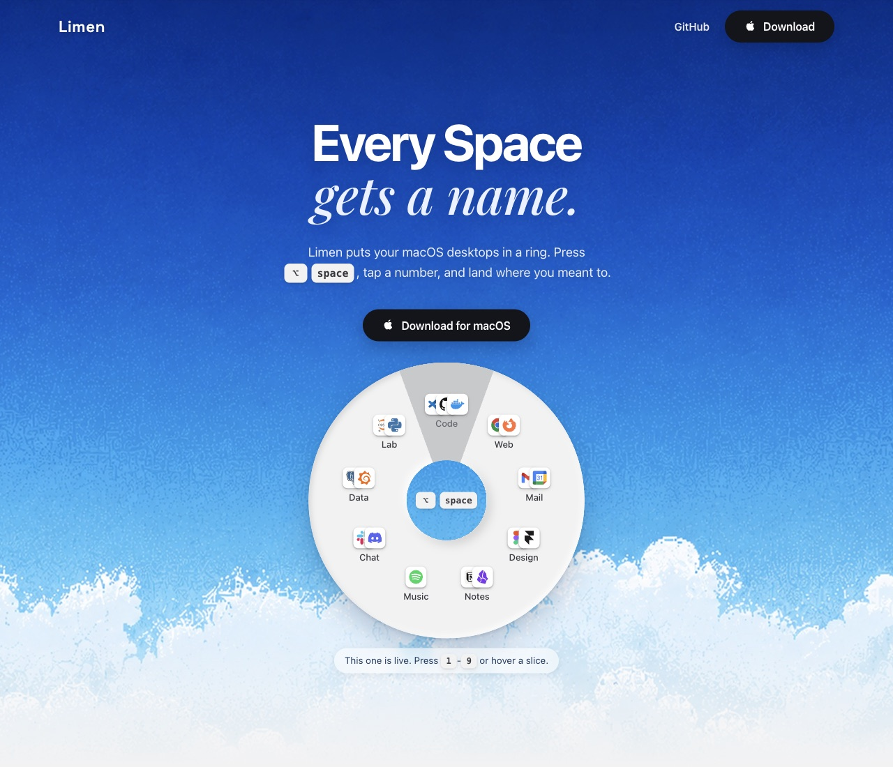

<p align="center">
  <a href="https://limen-lp.pages.dev/">
    
  </a>
</p>

# Limen

A macOS Space switcher that gives every desktop a name and identity.

Press `Option+Space` to summon a ring of your Spaces, each with its name, emoji, and running apps. Jump with `1`–`9`, navigate with arrow keys and `Enter`, dismiss with `Esc`.

**[Website](https://limen-lp.pages.dev/)** · **[Download](https://github.com/n-asuy/limen/releases/latest)**

## Setup

Limen needs two macOS settings:

1. **Accessibility permission** — System Settings → Privacy & Security → Accessibility. Limen prompts on first launch.
2. **Mission Control shortcuts** — enable "Switch to Desktop 1..9" under System Settings → Keyboard → Keyboard Shortcuts → Mission Control (disabled by default). Limen switches Spaces by triggering these shortcuts.

Good to know:

- Single display recommended. Space detection is fingerprint-based and cannot separate Spaces across multiple displays.
- Up to 9 Spaces are addressable.
- No network connections, except when you press "Check for updates" in Settings.

## Development

Requires [Rust](https://rustup.rs/) and [Bun](https://bun.sh/).

```bash
bun install
bun run dev                      # dev server
bun run package:mac:universal    # macOS bundle (arm64 + x86_64)
```

## License

[MIT](LICENSE) © Curino
